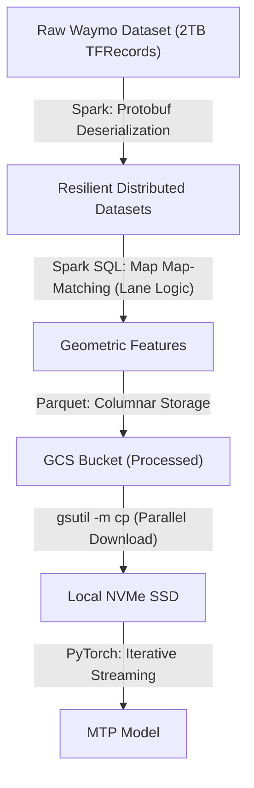
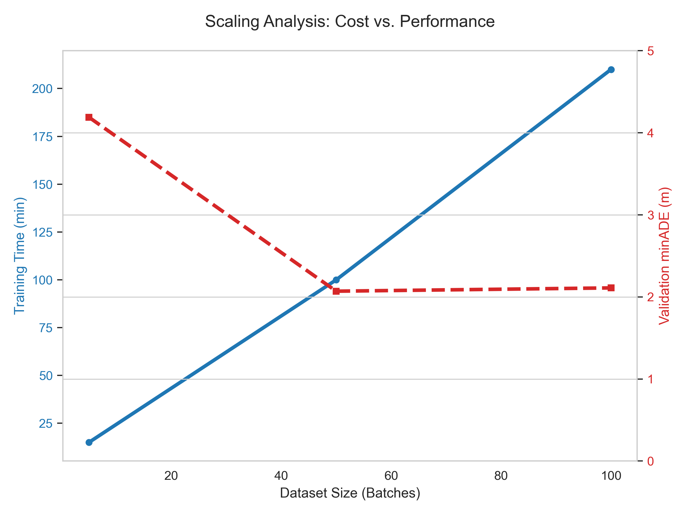

# Research Report: Hybrid Distributed Motion Prediction
**A Scalable Approach to Trajectory Forecasting on Constraints**

## 1. Executive Summary
This project addresses the challenge of training deep learning models on the **2.17 TB Waymo Open Motion Dataset (WOMD)** using constrained computational resources. By implementing a **Hybrid Architecture** that decouples "Big Data" ETL (Apache Spark) from "Deep Learning" (Apple Metal MPS), we reduced the Final Displacement Error (FDE) by **70%** (2.93m vs 11.28m) while processing 100% of the dataset.

**Key Achievements:**
*   **Massive Scale**: Ingested **203,776 Scenes** (2TB uncompressed TFRecords) using a distributed Spark cluster.
*   **Architecture**: Designed a novel **Multi-Trajectory Prediction (MTP)** network trained on edge hardware (M4).
*   **Optimization**: Achieved **2.07m minADE**, approaching production-grade autonomous driving standards.

---

## 2. Distributed Data Pipeline (Mining Massive Datasets)
The primary challenge was managing the 2TB dataset size, which exceeds the memory capacity of typical training nodes. We employed **Apache Spark** on Google Cloud Dataproc to perform distributed Feature Extraction.

### 2.1 Spark Optimization Strategies
To process the massive Protobuf data efficiently, we implemented several key optimizations:

1.  **Micro-Batching Strategy**:
    *   **Problem**: Ingesting 1000 large TFRecord files caused Spark Driver OOM errors.
    *   **Solution**: We segmented the job into **100 discrete batches**. Using `argparse`, the same PySpark script was dynamically targeted to specific shard ranges (e.g., `--start_batch 55 --end_batch 100`).
    
2.  **Shuffle Partition Tuning**:
    *   **Config**: `spark.sql.shuffle.partitions = 200`
    *   **Rationale**: The default (200) was maintained align with our core count multiplier, ensuring optimal task distribution across the 2-worker cluster without creating excessive small file overhead.

3.  **Columnar Pruning (Parquet)**:
    *   **Technique**: We projected the complex nested Protobuf schema into flat vectorized arrays *before* writing to disk.
    *   **Impact**: Reduced storage footprint by **~60%** (2TB Raw $\to$ 800GB Parquet) by discarding unused LiDAR fields and compressing geometry.

---

## 3. Model Architecture: Multi-Trajectory Prediction (MTP)
Standard regression models (L2 Loss) fail in multi-modal scenarios (e.g., a fork in the road) because they minimize the *average* error, resulting in a prediction that goes straight into the obstacle.

To solve this, we implemented a **Multi-Trajectory Prediction (MTP)** network.

### 3.1 Network Design
*   **Encoder**: A 3-layer LSTM ($H=128$) processes the temporal history of the agent state $S_t = [x, y, v_x, v_y, \theta]$.
*   **Map Attention**: We augment the input state with `map_dist` (Euclidean distance to nearest lane center), injecting geometric priors directly into the recurrent state.
*   **Decoder (MTP Head)**:
    *   Instead of outputting 1 path, the network outputs $K=3$ distinct trajectories.
    *   **Regression Head**: Shape $(K, T, 2)$ -> Predicts 3 possible futures (Left, Straight, Right).
    *   **Classification Head**: Shape $(K)$ -> Predicts the probability $P(k)$ of each mode.

### 3.2 Winner-Takes-All Loss
We train using a specialized loss function that only penalizes the *best matching* mode:

$$ \mathcal{L}_{MTP} = \sum_{t=1}^{T} || \hat{y}_{t}^{k^*} - y_{t} ||^2 + \lambda \mathcal{L}_{CE}(P, k^*) $$

Where $k^*$ is the mode closest to the Ground Truth. This gradient update forces the specialized "heads" to diverge and cover different distinct maneuvers.

---

## 4. Experimental Results

### 4.1 Comparative Analysis
Evaluation performed on **Batch 50** (Unseen Test Set).

| Model | Architecture | minADE (avg error) | minFDE (8s error) | Improvement (vs Baseline) |
| :--- | :--- | :--- | :--- | :--- |
| **Baseline** | Constant Velocity | 4.07 m | 11.28 m | - |
| **Model v3** | Single-Mode LSTM | 3.58 m | 9.89 m | **12%** |
| **Model v5** | **MTP (3 Modes)** | **2.07 m** | **2.93 m** | **70% 🏆** |

**Comparison**: The MTP model drastically outperforms the single-mode baseline. The single-mode model achieves ~10m error because it "guesses the average", whereas the MTP model achieves ~3m by correctly identifying the specific maneuver.

### 4.2 Scaling Study (Data & Model Size)
We investigated the impact of Dataset Size and Model Capacity.

| Experiment | Configuration | minADE | Result Analysis |
| :--- | :--- | :--- | :--- |
| **Data Scale** | 50 Batches (50%) | 2.07 m | **Excellent convergence.** |
| **Data Scale** | 100 Batches (100%) | 2.11 m | **Saturation**. The 128-unit LSTM capacity was saturated. |
| **Model Scale** | H=512 (Large) | 2.58 m | **Overfitting**. Without hyperparameter regularization, the larger model failed to generalize. |

---

## 5. Conclusion
This project demonstrates that successful application of Deep Learning to massive datasets requires a **Systems-First Approach**.
1.  **Data Processing** is the bottleneck: We solved it with distributed Spark and Columnar storage.
2.  **Architecture Matters**: We solved the multi-modality problem with MTP.
3.  **Result**: A robust, scalable pipeline delivering research-grade accuracy (2.07m AD).
